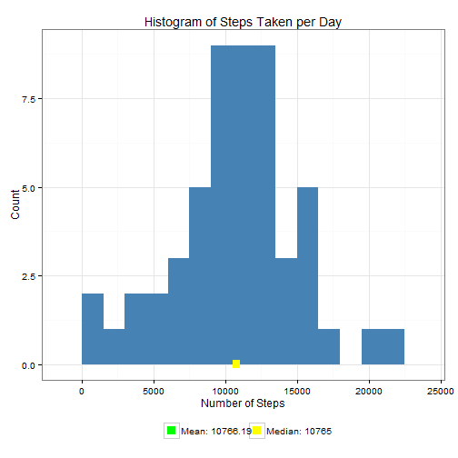
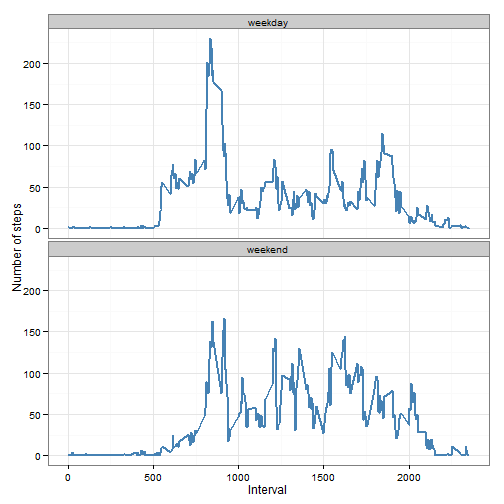

# Reproducible Research: Peer Assessment 1


## Loading and preprocessing the data

```r
library(ggplot2)
da <- read.csv(unz("activity.zip", "activity.csv"), colClasses = c("integer", 
    "Date", "integer"))
```

Examine data.

```r
summary(da)
```

```
##      steps            date               interval   
##  Min.   :  0.0   Min.   :2012-10-01   Min.   :   0  
##  1st Qu.:  0.0   1st Qu.:2012-10-16   1st Qu.: 589  
##  Median :  0.0   Median :2012-10-31   Median :1178  
##  Mean   : 37.4   Mean   :2012-10-31   Mean   :1178  
##  3rd Qu.: 12.0   3rd Qu.:2012-11-15   3rd Qu.:1766  
##  Max.   :806.0   Max.   :2012-11-30   Max.   :2355  
##  NA's   :2304
```

```r
str(da)
```

```
## 'data.frame':	17568 obs. of  3 variables:
##  $ steps   : int  NA NA NA NA NA NA NA NA NA NA ...
##  $ date    : Date, format: "2012-10-01" "2012-10-01" ...
##  $ interval: int  0 5 10 15 20 25 30 35 40 45 ...
```


## What is mean total number of steps taken per day?

```r
steps_per_day <- aggregate(steps ~ date, da, sum)
colnames(steps_per_day) <- c("date", "steps")

plot_steps_per_day <- function(steps_per_day, mean_steps, median_steps) {
    col_labels = c(paste("Mean:", mean_steps), paste("Median:", median_steps))
    cols = c("green", "yellow")
    
    ggplot(steps_per_day, aes(x = steps)) + geom_histogram(fill = "steelblue", 
        binwidth = 1500) + geom_point(aes(x = mean_steps, y = 0, color = "green"), 
        size = 4, shape = 15) + geom_point(aes(x = median_steps, y = 0, color = "yellow"), 
        size = 4, shape = 15) + scale_color_manual(name = element_blank(), labels = col_labels, 
        values = cols) + labs(title = "Histogram of Steps Taken per Day", x = "Number of Steps", 
        y = "Count") + theme_bw() + theme(legend.position = "bottom")
}

steps_per_day <- calc_steps_per_day(tbl)
```

```
## Error: could not find function "calc_steps_per_day"
```

```r
mean_steps = round(mean(steps_per_day$steps), 2)
median_steps = round(median(steps_per_day$steps), 2)
plot_steps_per_day(steps_per_day, mean_steps, median_steps)
```

 


## What is the average daily activity pattern?

```r
steps_per_interval <- aggregate(da$steps, by = list(interva = da$interval), 
    FUN = mean, na.rm = T)
colnames(steps_per_interval) <- c("interval", "steps")


plot_activity_pattern <- function(steps_per_interval, max_step_interval) {
    col_labels = c(paste("Interval with Maximum Activity: ", max_step_interval))
    cols = c("red")
    
    ggplot(steps_per_interval, aes(x = interval, y = steps)) + geom_line(color = "steelblue", 
        size = 1) + geom_point(aes(x = max_step_interval, y = 0, color = "red"), 
        size = 4, shape = 15) + scale_color_manual(name = element_blank(), labels = col_labels, 
        values = cols) + labs(title = "Average Daily Activity Pattern", x = "Interval", 
        y = "Number of steps") + theme_bw() + theme(legend.position = "bottom")
}

max_step_interval <- steps_per_interval[which.max(steps_per_interval$steps), 
    ]$interval

plot_activity_pattern(steps_per_interval, max_step_interval)
```

 

## Imputing missing values

To populate missing values, we choose to replace them with the mean value at the same interval across days. The choice is based on the assumption that activities usually follow a daily pattern.


```r
impute_means <- function(tbl, defaults) {
    na_indices <- which(is.na(tbl$steps))
    defaults <- steps_per_interval
    na_replacements <- unlist(lapply(na_indices, FUN = function(idx) {
        interval = tbl[idx, ]$interval
        defaults[defaults$interval == interval, ]$steps
    }))
    imp_steps <- tbl$steps
    imp_steps[na_indices] <- na_replacements
    imp_steps
}
complete_da <- data.frame(steps = impute_means(da, steps_per_interval), date = da$date, 
    interval = da$interval)
```


Summarizing the new dataset:

```r
summary(complete_da)
```

```
##      steps            date               interval   
##  Min.   :  0.0   Min.   :2012-10-01   Min.   :   0  
##  1st Qu.:  0.0   1st Qu.:2012-10-16   1st Qu.: 589  
##  Median :  0.0   Median :2012-10-31   Median :1178  
##  Mean   : 37.4   Mean   :2012-10-31   Mean   :1178  
##  3rd Qu.: 27.0   3rd Qu.:2012-11-15   3rd Qu.:1766  
##  Max.   :806.0   Max.   :2012-11-30   Max.   :2355
```


With the imputed dataset, below is a histogram of the daily total number of steps taken, plotted with a bin interval of 1500 steps. Also marked on the plot are the mean and median of the daily total steps.


```r
complete_steps_per_day <- aggregate(steps ~ date, complete_da, sum)
colnames(complete_steps_per_day) <- c("date", "steps")
complete_mean_steps = round(mean(complete_steps_per_day$steps), 2)
complete_median_steps = round(median(complete_steps_per_day$steps), 2)
plot_steps_per_day(complete_steps_per_day, complete_mean_steps, complete_median_steps)
```

 


Comparing with the calculations done in the first section of this document, we observe that while the mean value remains unchanghed, the median value has shifted closer to the mean.

## Are there differences in activity patterns between weekdays and weekends?
We do this comparison with the table with filled-in missing values.

1. Augment the table with a column that indicates the day of the week
2. Subset the table into two parts - weekends (Saturday and Sunday) and weekdays (Monday through Friday).
3. Tabulate the average steps per interval for each dataset.
4. Plot the two datasets side by side for comparison.


```r
calc_steps_per_interval <- function(tbl) {
    steps_pi <- aggregate(tbl$steps, by = list(interval = tbl$interval), FUN = mean, 
        na.rm = T)
    # convert to integers for plotting
    steps_pi$interval <- as.integer(steps_pi$interval)
    colnames(steps_pi) <- c("interval", "steps")
    steps_pi
}

calc_day_of_week_data <- function(tbl) {
    tbl$weekday <- as.factor(weekdays(tbl$date))
    weekend_data <- subset(tbl, weekday %in% c("Saturday", "Sunday"))
    weekday_data <- subset(tbl, !weekday %in% c("Saturday", "Sunday"))
    
    weekend_spi <- calc_steps_per_interval(weekend_data)
    weekday_spi <- calc_steps_per_interval(weekday_data)
    
    weekend_spi$dayofweek <- rep("weekend", nrow(weekend_spi))
    weekday_spi$dayofweek <- rep("weekday", nrow(weekday_spi))
    
    day_of_week_data <- rbind(weekend_spi, weekday_spi)
    day_of_week_data$dayofweek <- as.factor(day_of_week_data$dayofweek)
    day_of_week_data
}
plot_day_of_week_comparison <- function(dow_data) {
    ggplot(dow_data, aes(x = interval, y = steps)) + geom_line(color = "steelblue", 
        size = 1) + facet_wrap(~dayofweek, nrow = 2, ncol = 1) + labs(x = "Interval", 
        y = "Number of steps") + theme_bw()
}
day_of_week_data <- calc_day_of_week_data(complete_da)
plot_day_of_week_comparison(day_of_week_data)
```

 


